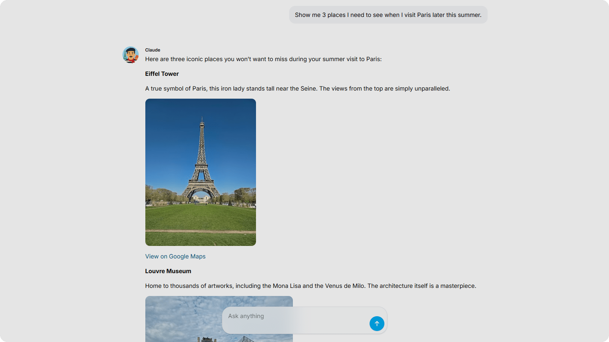
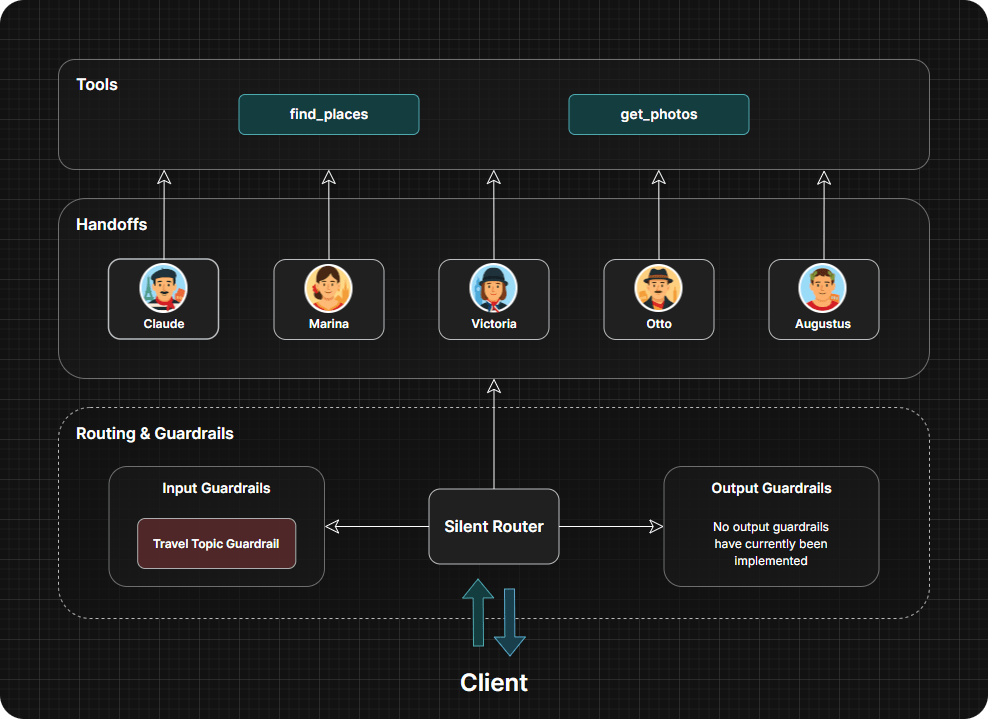

# 🏙️ City Guides

A multi-agent group chat prototype built with OpenAI's Agents SDK, Netlify Functions, and the Google Places API.

[](https://app.netlify.com/projects/city-guides/deploys)


## Overview

City Guides is an experimental web app that explores OpenAI's Agents SDK.

The user joins a group chat where five specialised agents, each representing a different city, offer local insights and recommendations. A silent router agent works behind the scenes, analysing context and directing each message to the most relevant guide.

Unlike most multi-agent apps that hide their specialised agents behind a single persona, City Guides makes that coordination transparent and part of the experience.



## Agent Orchestration

The diagram below provides a high-level overview of the key agent configurations.



### Routing

The Silent Router agent is responsible for silently routing user input to the appropriate city agent based on the context of the conversation. Its instructions define the city-to-agent handoff rules and specify a fallback to Victoria when the city is unclear or not yet mentioned.

The router is equipped with handoffs to all five city agents and uses the Agent SDK's built-in handoff tool to transfer messages accordingly. To ensure the router never speaks in the chat, its model settings include `toolChoice: "required"`, which forces it to always use the handoff tool rather than replying directly. This restriction ensures the routing logic remains completely invisible to the user.

The Silent Router includes an input guardrail that runs in parallel to the main message handling to help keep the conversation on-topic. The `travelTopicGuardrail` uses a dedicated agent whose sole task is to moderate user input, determine whether the message is travel-related, and return the following structured output:
`{ "isTravelTopic": <true | false> }`

If the result is false, the guardrail requests that the tripwire be triggered. The Agent SDK then throws an `InputGuardrailTripwireTriggered` error, interrupting the current execution path and triggering exception handling to inform the user that their enquiry was off-topic.

### Tool Use

Each city guide agent can embellish their responses with links and photos using tools powered by the Google Places API. While still early in development, the architecture is designed to support richer, city-specific tools like public transport lookups or event listings in the future.

## Getting Started 🚀

### Prerequisites

- Node.js v23 or higher
- Netlify account (with Neon database)
- OpenAI API key
- Google API key (for the Google Places API)

### Setup your local `.env` file

1. Copy .env-example to a new .env file in the project root.
2. Replace the placeholder values with your actual API keys and DB URL.

### Install dependencies

```bash
# From the project root
npm i
```

### Setup database

```bash
npm run db:setup
```

### Run the app

```bash
npm start
```

### Run the tests

```bash
npm t
```

## License 📝

### MIT License

Copyright (c) 2025 Simon Cragg

Permission is hereby granted, free of charge, to any person obtaining a copy
of this software and associated documentation files (the "Software"), to deal
in the Software without restriction, including without limitation the rights
to use, copy, modify, merge, publish, distribute, sublicense, and/or sell
copies of the Software, and to permit persons to whom the Software is
furnished to do so, subject to the following conditions:

The above copyright notice and this permission notice shall be included in all
copies or substantial portions of the Software.

THE SOFTWARE IS PROVIDED "AS IS", WITHOUT WARRANTY OF ANY KIND, EXPRESS OR
IMPLIED, INCLUDING BUT NOT LIMITED TO THE WARRANTIES OF MERCHANTABILITY,
FITNESS FOR A PARTICULAR PURPOSE AND NONINFRINGEMENT. IN NO EVENT SHALL THE
AUTHORS OR COPYRIGHT HOLDERS BE LIABLE FOR ANY CLAIM, DAMAGES OR OTHER
LIABILITY, WHETHER IN AN ACTION OF CONTRACT, TORT OR OTHERWISE, ARISING FROM,
OUT OF OR IN CONNECTION WITH THE SOFTWARE OR THE USE OR OTHER DEALINGS IN THE
SOFTWARE.
